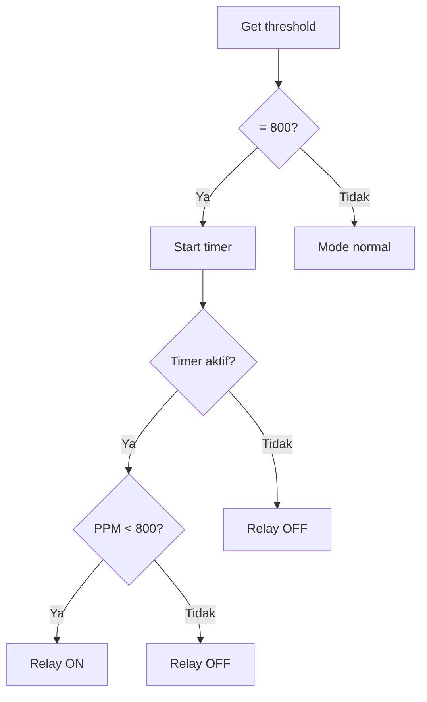

# Panduan ESP32 Final Version

Sistem kontrol hidroponik dengan mode panen otomatis dan auto-recovery.

## Fitur Utama

1. Mode Normal:

   - Kontrol PPM dinamis
   - Relay ON/OFF berdasarkan threshold
   - Monitoring semua sensor
   - Display info lengkap

2. Mode Panen (800 PPM):

   - Timer 1 jam aktif otomatis
   - Kontrol selama timer berjalan
   - Pompa OFF permanen setelah timer
   - Display countdown timer

3. Auto Recovery:
   - Kembali normal saat threshold < 800
   - Tidak perlu reset ESP32
   - Control relay langsung aktif

## Testing Mode

1. Ubah Durasi Timer:

```cpp
// 1 jam (default):
const unsigned long ONE_HOUR = 3600000;  // 3600 detik * 1000

// 1 menit (testing):
const unsigned long ONE_HOUR = 60000;    // 60 detik * 1000

// 10 detik (debug):
const unsigned long ONE_HOUR = 10000;    // 10 detik * 1000
```

2. Test Sequence:

```
Mode Normal -> Mode Panen -> Timer Habis -> Recovery
│
├─ Set PPM 400
│  └─ Kontrol normal aktif
│
├─ Set PPM 800
│  ├─ Timer mulai
│  ├─ Kontrol 1 jam
│  └─ Pompa OFF
│
└─ Set PPM 100
   └─ Kembali normal
```

## Indikator Status

1. LCD Display:

```
Mode Normal:           Mode Panen:
ppm=350 pH=7.00       ppm=750 pH=7.00
tmp=25.5 cap=75%      Panen: 45:30
```

2. Serial Monitor:

```
PPM threshold diupdate: 800
Mode panen dimulai!
- Timer 1 jam aktif
- Pompa akan ON jika PPM < 800
- Setelah 1 jam, pompa permanen OFF

Mode Panen - Relay ON (PPM: 750.0 dibawah 800)
Sisa waktu: 00:45:30

Timer 1 jam habis! Pompa OFF permanen.
```

## Flow Kontrol



## Troubleshooting

1. Timer Tidak Akurat:

   - Cek ONE_HOUR value
   - Monitor millis() overflow
   - Verifikasi delay()

2. Relay Tetap ON:

   - Cek harvestMode flag
   - Monitor timerStarted
   - Verifikasi PPM value

3. Recovery Gagal:
   - Cek threshold value
   - Monitor flag reset
   - Verifikasi API response

## Quick Test

1. Set durasi 1 menit:

```cpp
const unsigned long ONE_HOUR = 60000;
```

2. Run test sequence:

- Set PPM 400 -> cek kontrol normal
- Set PPM 800 -> tunggu 1 menit
- Verifikasi pompa OFF
- Set PPM 100 -> cek recovery

3. Monitor:

- Serial output
- LCD display
- Relay status
- PPM readings
