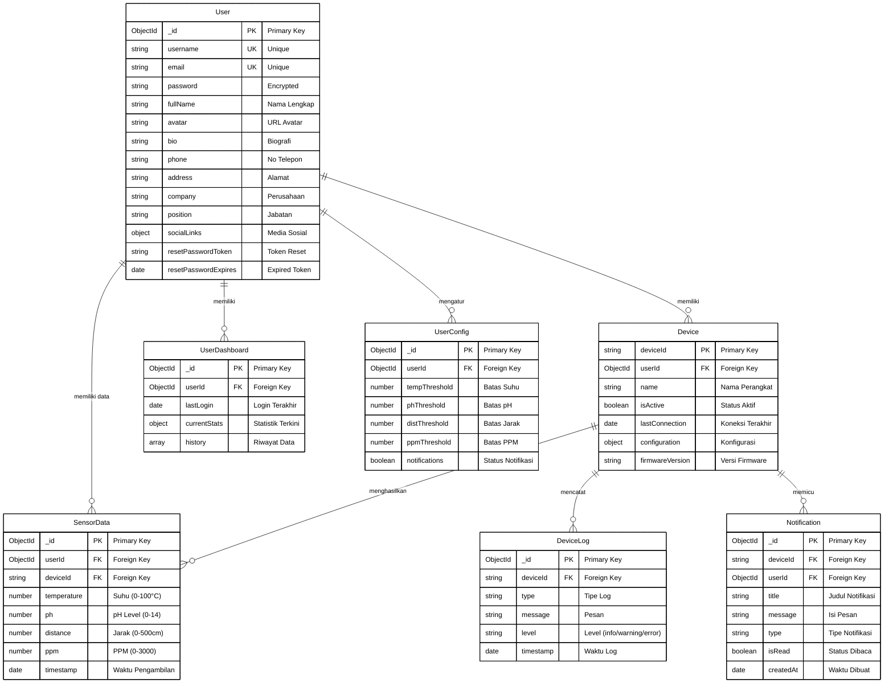

# ERD Sistem Hidroponik - Diagram Lengkap

## Penjelasan ERD Lengkap

### 1. Entitas Utama:

- User: Pengguna sistem
- Device: Perangkat hidroponik
- SensorData: Data pengukuran sensor
- UserDashboard: Data monitoring realtime
- UserConfig: Konfigurasi pengguna
- DeviceLog: Log aktivitas perangkat
- Notification: Notifikasi sistem

### 2. Relasi Utama:

- User - SensorData: One-to-Many
- User - Device: One-to-Many
- Device - SensorData: One-to-Many
- Device - DeviceLog: One-to-Many
- Device - Notification: One-to-Many

### 3. Validasi & Batasan:

- Data Sensor:
  - Suhu: 0-100°C
  - pH: 0-14
  - Jarak: 0-500cm
  - PPM: 0-3000

### 4. Index Optimasi:

1. SensorData:
   - (userId, timestamp)
   - (deviceId, timestamp)
2. DeviceLog:
   - (deviceId, timestamp)
3. Notification:
   - (userId, isRead)
   - (deviceId, createdAt)

### 5. Fitur Keamanan:

- Password encryption
- Token reset password
- Sistem login tracking
- Device authentication
