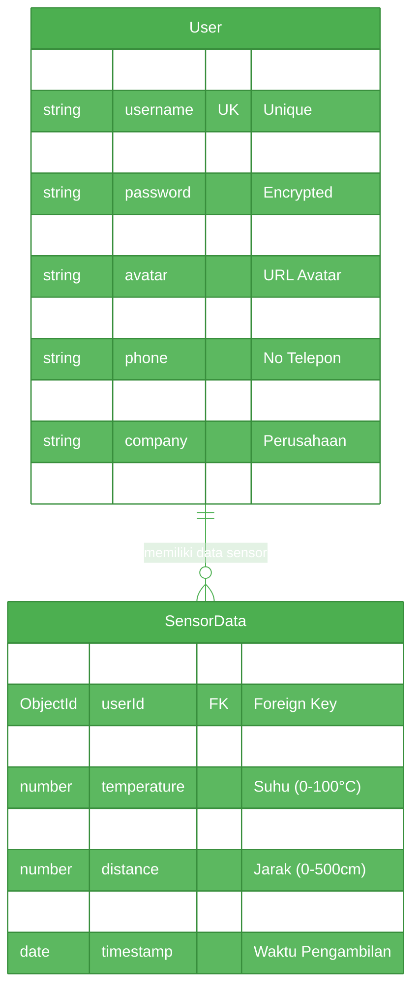

# ERD Sistem Hidroponik - Bagian 1: Struktur Utama

```mermaid
%%{init: {'theme': 'base', 'themeVariables': { 'primaryColor': '#4CAF50', 'primaryTextColor': '#fff', 'primaryBorderColor': '#388E3C', 'lineColor': '#4CAF50', 'secondaryColor': '#81C784', 'tertiaryColor': '#C8E6C9'}}}%%

erDiagram
    User ||--o{ SensorData : "memiliki data sensor"
    User {
        ObjectId _id PK "Primary Key"
        string username UK "Unique"
        string email UK "Unique"
        string password "Encrypted"
        string fullName "Nama Lengkap"
        string avatar "URL Avatar"
        string bio "Biografi"
        string phone "No Telepon"
        string address "Alamat"
        string company "Perusahaan"
        string position "Jabatan"
    }

    SensorData {
        ObjectId _id PK "Primary Key"
        ObjectId userId FK "Foreign Key"
        string deviceId "ID Perangkat"
        number temperature "Suhu (0-100°C)"
        number ph "pH Level (0-14)"
        number distance "Jarak (0-500cm)"
        number ppm "PPM (0-3000)"
        date timestamp "Waktu Pengambilan"
    }
```
