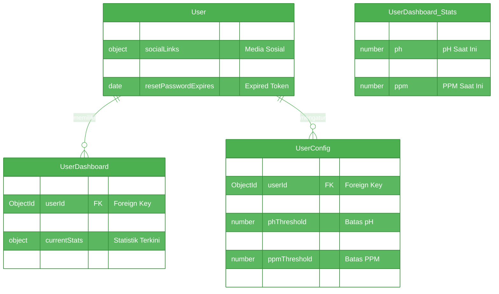

# ERD Sistem Hidroponik - Bagian 2: Detail Monitoring & Konfigurasi

```mermaid
%%{init: {'theme': 'base', 'themeVariables': { 'primaryColor': '#4CAF50', 'primaryTextColor': '#fff', 'primaryBorderColor': '#388E3C', 'lineColor': '#4CAF50', 'secondaryColor': '#81C784', 'tertiaryColor': '#C8E6C9'}}}%%

erDiagram
    User ||--o{ UserDashboard : "memiliki"
    User ||--o{ UserConfig : "mengatur"

    User {
        ObjectId _id PK "Primary Key"
        object socialLinks "Media Sosial"
        string resetPasswordToken "Token Reset"
        date resetPasswordExpires "Expired Token"
    }

    UserDashboard {
        ObjectId _id PK "Primary Key"
        ObjectId userId FK "Foreign Key"
        date lastLogin "Login Terakhir"
        object currentStats "Statistik Terkini"
        array history "Riwayat Data"
    }

    UserConfig {
        ObjectId _id PK "Primary Key"
        ObjectId userId FK "Foreign Key"
        number tempThreshold "Batas Suhu"
        number phThreshold "Batas pH"
        number distThreshold "Batas Jarak"
        number ppmThreshold "Batas PPM"
        boolean notifications "Status Notifikasi"
    }

    UserDashboard_Stats {
        number temperature "Suhu Saat Ini"
        number ph "pH Saat Ini"
        number distance "Jarak Saat Ini"
        number ppm "PPM Saat Ini"
    }
```
