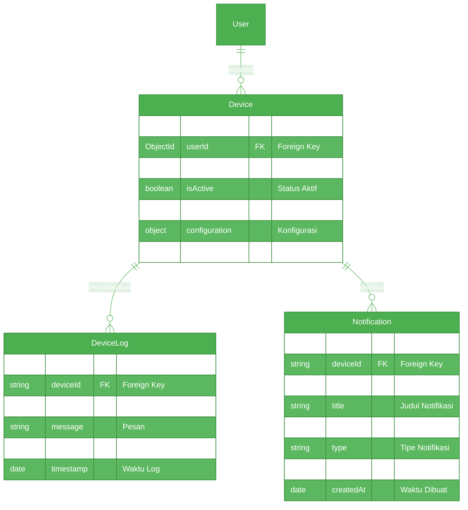

# ERD Sistem Hidroponik - Bagian 3: Perangkat & Notifikasi

## Petunjuk Diagram

### Relasi Antar Tabel:
1. User → SensorData (1:N)
   - Satu user dapat memiliki banyak data sensor
2. User → Device (1:N)
   - Satu user dapat memiliki beberapa perangkat
3. Device → DeviceLog (1:N)
   - Satu perangkat dapat menghasilkan banyak log
4. Device → Notification (1:N)
   - Satu perangkat dapat memicu banyak notifikasi

### Validasi Data:
1. Sensor:
   - Temperature: 0-100°C
   - pH: 0-14
   - Distance: 0-500cm
   - PPM: 0-3000

### Index untuk Optimasi:
1. SensorData:
   - (userId, timestamp)
   - (deviceId, timestamp)
2. DeviceLog:
   - (deviceId, timestamp)
3. Notification:
   - (userId, isRead)
   - (deviceId, createdAt)
